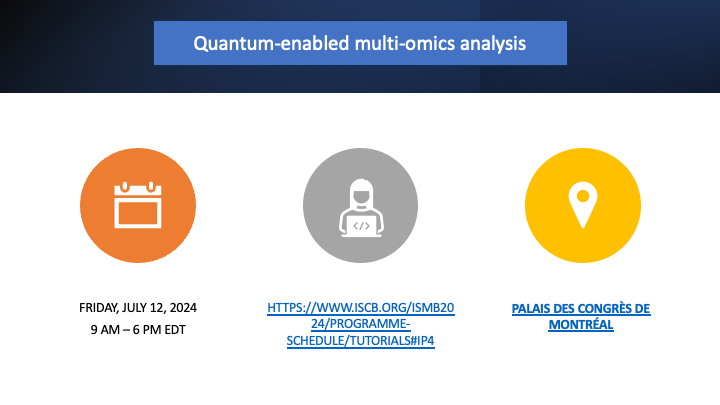
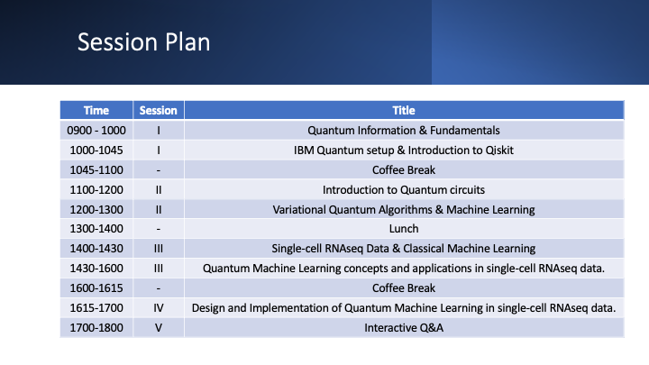

# Quantum-enabled multi-omics analysis



## Schedule



### Prerequisites
To start with the tutorial and use the notebooks you will need to create an environment 

1. Create the environment from the `req.txt` file:
```
conda create -n "QML" 
pip install -r req.txt
```
* Note: if you receive the error `bash: conda: command not found...`, you need to install Anaconda to your development environment (see "Additional resources" below)

2. Activate the new environment:
```
conda activate QML
```
3. Verify that the new environment was installed correctly:
```
conda env list
```

